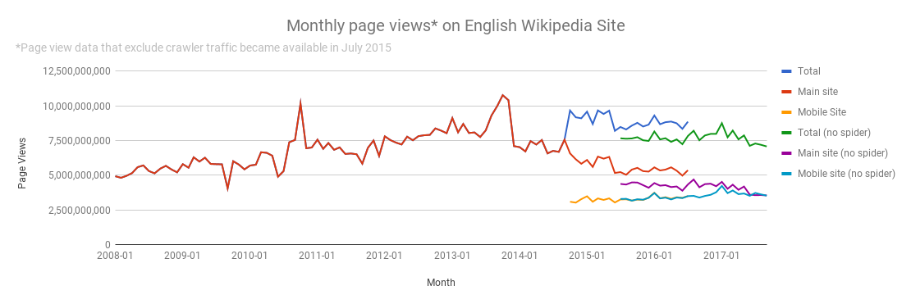

# English Wikipedia page views, 2008 - September 2017

### Goal:   
The Goal of this project is to create a visualization that shows how page views on the en.wikipedia.org have varied from mobile and desktop sources from 2008 through September 2017. The final visualization will look like the one below:




Please note that there is some inconsistency in data across the time period. Prior to July 2015, all data included pageviews by users as well as scrapers (This data is access from the pagecount API referenced below). From July of 2015 onward, the data focuses on user generated views, and ignores spider traffic (This data is accessed from the pageviews API, referenced below).


### Data source: 


The data was sourced from the Wikimedia REST API using two separate endpoints. The pageviews endpoint and the legacy pagecounts endpoint. See below for details.

Rules of REST API: as listed here: https://wikimedia.org/api/rest_v1/#/
- Limit your clients to no more than 200 requests/s to this API. Each API endpoint's documentation may detail more specific usage limits.  
- Set a unique User-Agent or Api-User-Agent header that allows us to contact you quickly. Email addresses or URLs of contact pages work well.  
- By using this API, you agree to Wikimedia's Terms of Use and Privacy Policy. Unless otherwise specified in the endpoint documentation below, content accessed via this API is licensed under the CC-BY-SA 3.0 and GFDL licenses, and you irrevocably agree to release modifications or additions made through this API under these licenses. See https://www.mediawiki.org/wiki/REST_API for background and details.

**Licenses:** Data accessible via both of the below endpoints is available under the CC0 1.0 license, meaning it is part of the public domain. See this page for more details on how you can use this data: https://creativecommons.org/publicdomain/zero/1.0/  

**The Pageviews endpoint provides access to desktop, mobile web, and mobile app traffic data from July 2015 through September 2017.**
*The data on this API separates user generated views from spider/crawler generated views if desired. Please select 'user' when accessing data.*
https://wikimedia.org/api/rest_v1/#!/Pageviews_data/get_metrics_pageviews_aggregate_project_access_agent_granularity_start_end 
The rate limit is: 100 req/s


Documentation for the Pageviews API is here:  
https://wikitech.wikimedia.org/wiki/Analytics/AQS/Pageviews  


**The legacy Pagecounts endpoint provides access to desktop and mobile traffic data from January 2008 through July 2016:**
*The data on this API does not separate user generated views from spider/crawler generated views.*

https://wikimedia.org/api/rest_v1/#!/Legacy_data/get_metrics_legacy_pagecounts_aggregate_project_access_site_granularity_start_end  
Rate limit: 100 req/s  

Documentation for the pagecounts API is here:  
https://wikitech.wikimedia.org/wiki/Analytics/AQS/Legacy_Pagecounts


**The terms of use for wikimedia can be found here:**
https://wikimediafoundation.org/wiki/Terms_of_Use/en


## Final Data File

The data in these files were extracted by Alyssa Goodrich on October 17, 2017

The Final data file contains the following fields: 


|Field                  | Value        | Includes Spider/Crawler| Dates Available |
|-----------------------|--------------|------------------------|-----------------|
|Date                   | Mon-YYYY     |  NA                    |                 |
|Month                  | MM           |  NA                    |                 | 
|Year                   | YYYY         |  NA                    |                 |
|pagecount_all_views    |num_views     |  Yes                   | Jan '08-Jul '16 |
|pagecount_desktop_views|num_views     |  Yes                   | Jan '08-Jul '16 |
|pagecount_mobile_views |num_views     |  Yes                   | Jan '08-Jul '16 |
|pageview_all_views     |num_views     |  No                    | Jul '15-Sep '17 |
|pageview_desktop_views |num_views     |  No                    | Jul '15-Sep '17 |
|pageview_mobile_views  |num_views     |  No                    | Jul '15-Sep '17 |


Field Descriptions: 
- Date: Year and Month in which page views were counted
- Month: Month in which page views were counted 
- Year: Year of period in which page views were counted
- pagecount_all_views: Number of website views during period, including all access points as well as spiders/crawlers
- pagecount_desktop_views: Number of website views during period, accessed from desktop including spiders/crawlers
- pagecount_mobile_views: Number of website views during period, accessed from mobile including spiders/crawlers
- pageview_all_views: Number of website views during period, accessed from all access points excluding spiders/crawlers     
- pageview_desktop_views: Number of website views during period, accessed from desktop, excluding spiders/crawlers     
- pageview_mobile_views: Number of website views during period, accessed from mobile, excluding spiders/crawlers   

## Visualization


The categories in the visualization link to to the categories in the data as follows:
- Total: pagecount_all_views
- Main Site: pagecount_desktop_views
- Mobile site: pagecount_mobile_views
- Total (no spider): pageview_all_views
- Main Site (no spider): pageview_desktop_views
- Mobile site (no spider) pageview_mobile_views


```python

```
